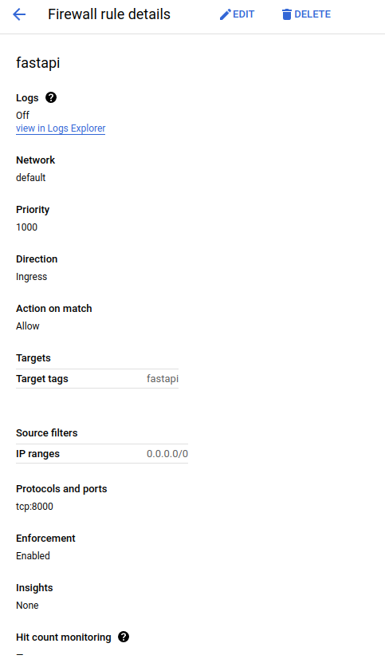

### FastAPI service for IMDB sentiment classifier.

##### Overview -
This project involves building a RESTful API service using FastAPI to serve a IMDB sentiment classifier model. The service receives text input, processes it through the model, and returns the predicted sentiment and the probability. The project covers the following aspects:
- FastAPI Framework: Utilises FastAPI to create an API.
- ML Model: Uses a pre-trained sentiment analysis model.
- Deployment: Containerised the application using Docker and deploys it on Google Cloud Platform

##### Prerequisites - 
###### Language -
- Python 3.9.13
###### Packages -
- fastapi
- Uvicorn
- pydantic
- tensorflow - If running on CPU
- tensorflow[and-cuda] - If GPU is enabled

All the libraries will be present in the requirements.txt file in the project folder.

##### Setting Up the Environment -
Create a virtual environment
- `Python3 -m venv yolo`
- `Source yolo/bin/activate #To use the environment`

Install required Packages
- `pip install -r requirements.txt`

To Deactivate the Environment
- `deactivate`

##### Project Structure
The project directory contains the following files:
```
├──mini-project/
|   ├──Dockerfile
|   ├──main.py
|   ├──requirements.txt
|   ├──sentiment-model.h5
```

##### FastAPI Application
The FastAPI application (‘main.py’) serves the IMDB sentiment classifier model.

##### Dockerization:
Create a file called Dockerfile and include the following commands

```
FROM python:3.9.13

WORKDIR /app

COPY requirements.txt /app/requirements.txt
RUN pip install -no-cache-dir -r requirements.txt

COPY . /app

EXPOSE 8000

CMD [“uvicorn”, “main:app”, “--host”, “0.0.0.0”, “--port”, “8000”]
```

##### Building the Docker Image:
First check if docker is installed or not with “sudo docker ps” Command.
If it is not installed use the following command to install it
`sudo apt-get install -y docker.io`

Next run the following docker commands
- `sudo systemctl start docker` # Start the docker

- `sudo usermod -aG docker $USER` # Adding our user to the group

- `newgrp docker` # Logout and login to the system or use this command reset the user group

- `sudo docker build -t fastapi-sentiment .`  # build the docker with the name “fastapi-sentiment”

- `sudo docker run -d -p 8000:8000 fastapi-sentiment`  # run the docker with the following command


##### Testing the API
Test the API locally using the Fast API documentation
`http://localhost:8000/docs`

Request Format
Using ‘curl’
```
curl -X 'POST' \
  'http://localhost:8000/predict' \
  -H 'accept: application/json' \
  -H 'Content-Type: application/json' \
  -d '{
  "text": "The first episode is interesting and you get the feeling that this might be quite good! People get stuck in a village for mysterious reasons and get slaughtered by creepy monsters."
  }'
```
Response Format
`{"Sentiment":"positive", "Probability":0.99}`


Once this is done we can move on to the deployment of docker in GCP 
1. Create a GCP VM Instance:

2. After the machine is spun up, add the local machine machine SSH key “id_ed25519.pub” to a file called ".ssh/authorized_keys" in the VM.

3. Transfer the project files to VM
`scp -r mini-project username@externalIP:~/.`

4. Once the files are copied, follow the same steps mentioned in “Building the Docker Image”

5. Once the docker is built and running, we need to port forward port 8000.
In the networking interface tab of the created Virtual Machine add a new firewall rule to port forward.



Now using the VM’s external IP address we can access the API
`http://<external-ip>:8000/docs`

Or 

```
curl -X 'POST' \
  'http://<external-ip>:8000/predict' \
  -H 'accept: application/json' \
  -H 'Content-Type: application/json' \
  -d '{
  "text": "The first episode is interesting and you get the feeling that this might be quite good! People get stuck in a village for mysterious reasons and get slaughtered by creepy monsters."
  }'
  ```
